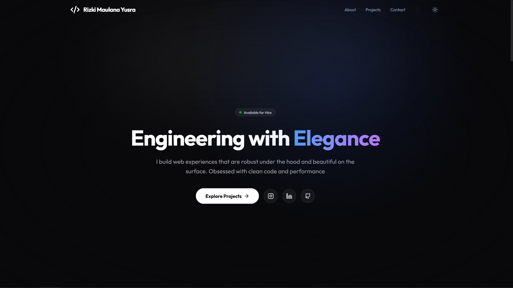

# Rizki Maulana Yusra - Portfolio

> A modern, responsive personal portfolio website built to showcase my projects and software engineering skills.

## 🔗 Live Demo
Click the link below to visit the live website:
🚀 **[Click](https://nama-project-kamu.vercel.app)**

---

## 🚀 Tech Stack
Built with the latest industry-standard technologies:
- **Framework:** React+ TypeScript (Vite)
- **Styling:** Tailwind CSS
- **Animations:** Framer Motion
- **Icons:** Lucide React

## 🛠️ Features
- 🌓 **Dark/Light Mode:** Persisted theme preference using Local Storage.
- ⚓ **Smart ScrollSpy:** Active navigation state updates as you scroll.
- 📱 **Fully Responsive:** Mobile-first design approach.
- ⚡ **High Performance:** Optimized with Vite and lazy loading components.

---

## 📫 Connect with Me
- Instagram: [Rizki Maulana Yusra](https://www.instagram.com/rizkiyusra/)
- LinkedIn: [Rizki Maulana Yusra](https://www.linkedin.com/in/rizki-maulana-yusra/)
- GitHub: [Rizki Maulana Yusra](https://github.com/rizkiyusra/)

© 2026 **Rizki Maulana Yusra**.